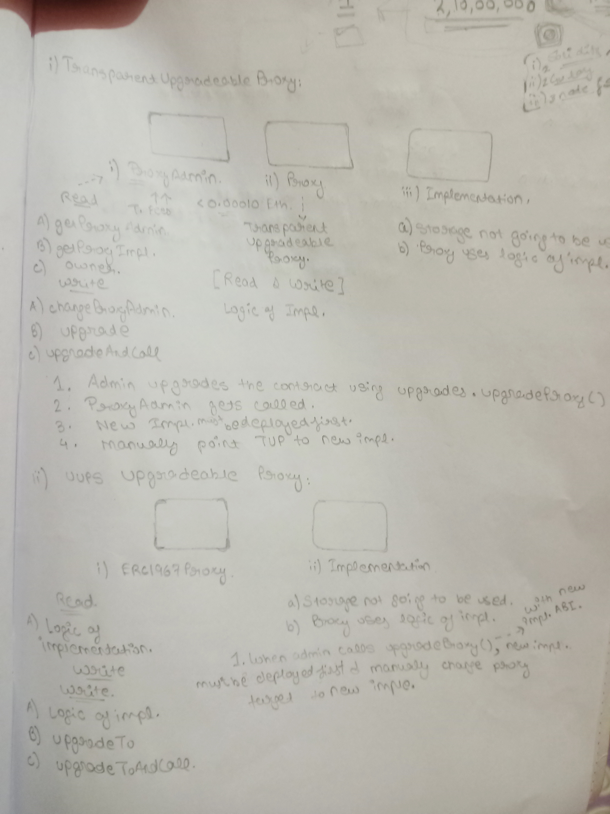
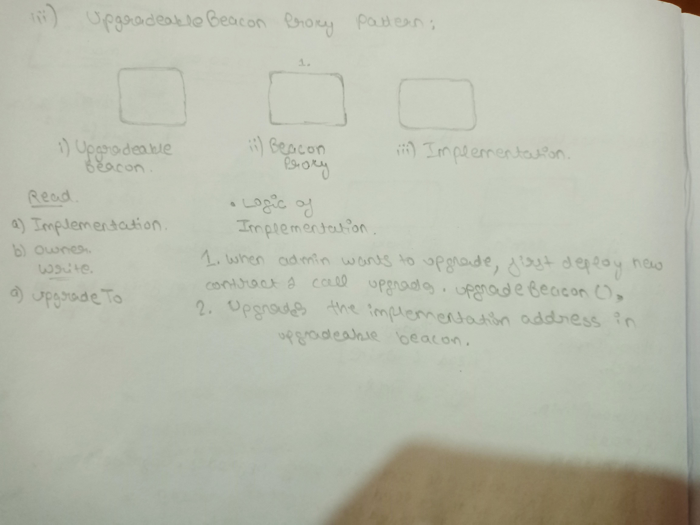

# Beacon Proxy Pattern Sample Project

In simple words, Logic behind this proxy pattern is as follows : 

- Upgradeable Beacon is deployed which is having implementation contract address.
- ( Any number of ) Beacon proxies can be deployed which will all point to the same Upgradeable Beacon.
- To upgrade the proxy, we simple upgrade the beacon which now points to new implementation address and this way all the proxy will now delegate calls to the new implementation address returned by upgraded beacon.

## Q. How it's different from TransparentUpgradeable and UUPS Proxy pattern?

Here is some takeaway which might help you clear most of your doubts regarding proxy patterns.

